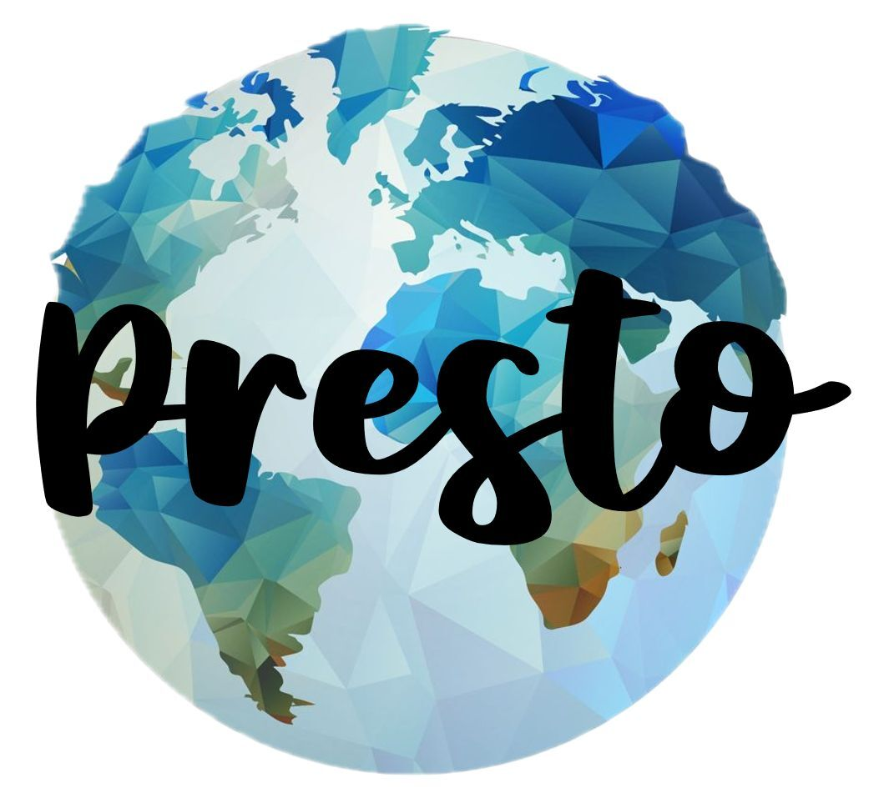

---

## Paleoclimate Reconstruction Storehouse (PReSto): Using PReSto's custom reconstruction engine to modify, customize and visualize paleoclimate reconstructions

### March 19-21, 2025, Catalina Island, California

Paleoclimate reconstructions are among the most widely used scientific products from the paleoclimate community. They constitute statistical inference based on thousands of field and laboratory measurements: a single chart like the "Hockey Stick" temperature reconstruction of the past 1,000 years synthesizes what is known about past climate variations in a form that is easily digestible within and beyond the geosciences: in climate science of course, but also the paleogeosciences at large, and even in the social and life sciences. However, such reconstructions are infrequently updated and commonly lag many years behind the latest data and methods. Until recently, the lack of a central clearinghouse also made them difficult to find. Finally, paleoclimate reconstructions involve potentially many subjective choices that have not been exhaustively explored, and are opaque to most users. Enter the Paleoclimate Reconstruction "Storehouse" (PReSto), an NSF-funded project. 

The PReSto Platform, at https://paleopresto.org/ does several things, including:

* Providing broad access to paleoclimate reconstructions via a responsive web front end.
* Allow users to easily visualize, download and compare published reconstructions.
* Enables users to rerun, adjust input data and parmaters, and customize paleoclimate reconstructions for their own purposes.

This training workshop is designed to introduce users to all of three of these capabilities, with a focus on the use of PReSto's custom reconstruction engine to modify, customize and visualize paleoclimate reconstructions .

* *Intended audience:* researchers who use paleoclimate reconstructions to inform some aspect of their research. Participants should come with at least some understanding of the general concepts of paleoclimatology and paleoclimate reconstructions. Participants do not need to have any experience creating paleoclimate reconstructions. Participants from paleoclimate-adjacent fields, including paleoecology, history, paleontology, archeology and many more are especially encouraged to attend.
* *Learning objectives:* Introduction to the PReSto platform;  basics of paleoclimate reconstruction approaches; use PReSto's Custom Reconstruciton Engine
* *Description:* The workshop will consist of a blend of lectures and directed tutorials, as well as dedicated time for participants to explore applying the PReSto platform and Custom Reconstruction Engine to their own applications. Participants will be expected to present the outcome of the workshop on the last day.

### Location and format
This training will be in-person on Catalina Island. Participants will travel to Los Angeles, where we will take a boat to the Wrigley Marine Science Center, where we will stay for the 3-day, 2-night workshop. The workshop will consist of a blend of lectures and directed tutorials, as well as dedicated time for participants to explore applying the PReSto platform and Custom Reconstruction Engine to their own applications. Participants will be expected to present the outcome of the workshop on the last day.

### Participating
* Register [here](https://forms.gle/bQW7U3TxvAy2iHWW6) by **February 10th, 2025**. 
* We have funding from the National Science Foundation to provide travel grants that will fully or partially support US-based participants, based on need and funding availability.
* Feel free to [email us](mailto:linkedearth@gmail.com) with any additional question.

### Schedule

Closer to the event, a schedule will be available [here](https://linkedearth.github.io/presto-catalina-workshop/schedule).

### Support

This workshop is supported by NSF grant EAR-1948746 & 1948822 from the [Geoinformatics program](https://new.nsf.gov/funding/opportunities/gi-geoinformatics). Travel grants are available for US-based participants. 

